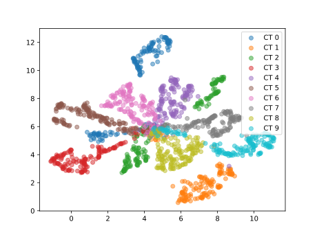

# SERGIO-JAX: Fast simulation of single-cell gene expressions

This is a JAX implementation of [SERGIO](https://www.sciencedirect.com/science/article/pii/S2405471220302878), a simulator for single-cell gene expressions guided by gene regulatory networks (GRNs). It is up to 100x faster than the original implementation and can be used to simulate large datasets (~ thousands of genes and cells) within a few seconds on a consumer laptop.

<p align="center">
    <figure>
      
      <figcaption>2D UMAP of SERGIO-JAX created gene expressions</figcaption>
    </figure>
</p>

Authors: Yunshu Ouyang, Alexander Hägele

---
## What is SERGIO?
SERGIO is a simulator for single-cell expression data guided by gene regulatory networks (GRNs). The GRN can be a user-specified parameter, which allows for flexible simulation of data that closely ressembles real-world datasets. SERGIO can simulate any number of cell types and number of cells (samples). Mathematically, the simulator uses stochastic differential equations based on the Chemical Langevin Equation (CLE).


Please refer to the original paper for more details:
```bash
Dibaeinia, P., & Sinha, S. (2020). SERGIO: a single-cell expression simulator guided by gene regulatory networks. Cell systems, 11(3), 252-271.
```
* Link: https://www.sciencedirect.com/science/article/pii/S2405471220302878
* GitHub: https://github.com/PayamDiba/SERGIO

## What does this repository contain?
This repository provides a reimplementation of SERGIO ***in JAX***. It is `jit`-compatible, which allows the usage of hardware-accelerators (such as GPUs) for fast inference. We focus on the steady-state simulation of the cell types.

## Usage
We include a simple notebook in [run_sergio.ipynb](run_sergio.ipynb) that demonstrates the usage of the `SergioJAX` class.
The basic usage was designed to closely follow the [original implementation](https://github.com/PayamDiba/SERGIO) and can be summarized as follows:

* First, instantiate the simulator via
```python
sim = SergioJAX(
    n_genes=n_genes,
    n_cell_types=n_cell_types,
    n_sc=n_sc,
    noise_amplitude=noise_amplitude,
    noise_type=noise_type,
    decays=decays,
)
```
* Then, initialize the graph parameters
```python
sim.custom_graph(
    graph,
    k, # contribution rates
    basal_rates,
    hill,
)
```
In addition, our implementation also provides the possibility to learn the contribution rates and basal rates from real data using Ridge regression. In this case, we require the graph structure, hill coefficient as well as the edge type (activator or repressor) as input.
```python
sim.custom_graph(
    graph,
    k, # sign matrix with +1 for activator, -1 for repressor
    data, # real data matrix
    hill,
)
```
* Finally, run the simulation and extract the clean data
``` python
# rng is jax random key
rng, subrng = jax.random.split(rng)
sim.simulate(rng=subrng)

# shape: [number_bins (#cell types), number_genes, number_sc (#cells per type)]
rng, subrng = jax.random.split(rng)
expr = sim.getExpressions(rng=subrng)
```

Additionally, it is possible to add technical noise to the expressions, as outlined in [run_sergio.ipynb](run_sergio.ipynb).

## Speedup
|   `# genes`	|  SERGIO (_original_) 	|  SERGIO-JAX (incl. compilation time) 	| SERGIO-JAX (after jit)  	|
|:---:	        |:---:	                |:---:	                                |:---:	                    |
|   200	        |   	113s            |   	         1.4s                   |   	   0.6s             |
|   400	        |   	285s            |   	         3.1s                   |   	    2.1s            |
|   1000	    |   	---             |   	         8.0s                   |   	    7.0s            |


Rough estimates of runtime on a consumer laptop (Macbook Pro 14', M1 Pro, 16GB RAM) for varying number of genes, 10 cell types, and 150 cells per type. The simulation parameters are the same across all samples. The JAX implementation is up to ~100x faster than the original implementation.

---
### Dependencies
SERGIO-JAX only depends on `jax` and `jaxlib`. The code was tested with version `jax` version 0.4.12 and Python 3.8.16. 

Our example notebook additionally uses `umap-learn`, `igraph`, `matplotlib`, and `scikit-learn`, but the backbone SERGIO simulator does not require these packages.


## Credits
If you use SERGIO-JAX in your project, please cite the [original paper](https://www.sciencedirect.com/science/article/pii/S2405471220302878) and acknowledge our repository!

_Yunshu Ouyang, Alexander Hägele. 2023._
